<p align="center">
  
</p>

# كواكب النظام الشمسي

<p align="center" dir="rtl">
  <a href="README.md"></a>
  <a href="README.es.md"></a>
  <a href="README.fr.md"></a>
  <a href="README.de.md"></a>
  <a href="README.pt-BR.md"></a>
  <a href="README.zh-CN.md"></a>
  <a href="README.ja.md"></a>
  <a href="README.ko.md"></a>
  <a href="README.it.md"></a>
  <a href="README.ar.md"></a>
</p>

<p align="center">
  <a href="https://dacameragirl.github.io/solar-planets/"></a>
  <a href="https://dacameragirl.github.io/links/"></a>
  <a href="https://dacameragirl.github.io/latent-observatory/"></a>
  
  
</p>

<p align="center">
  
</p>

<div dir="rtl">

**نظامنا الشمسي — مكان يمكنك الدوران حوله.**

نظام شمسي سينمائي ثلاثي الأبعاد مستقل في المتصفح. كواكب حقيقية، مدارات حية، حلقات زحل، قمر الأرض وواجهة مرصد enterprise. نسيج 2K مُضمّن بنفس المصدر (Solar System Scope)، معالجة Unreal Bloom وواجهة premiere — بلا تضمينات، بلا تعلم آلي، بلا خادم. مشتق من طبقة النظام الشمسي في [مرصد الفضاء الكامن](https://github.com/DaCameraGirl/latent-observatory).

<p align="center">
  
</p>

<p align="center">
  
</p>

## المستودع مقابل التطبيق المباشر

| ماذا | URL |
|---|---|
| **التطبيق المباشر** | [dacameragirl.github.io/solar-planets](https://dacameragirl.github.io/solar-planets/) |
| **مستودع GitHub** | [github.com/DaCameraGirl/solar-planets](https://github.com/DaCameraGirl/solar-planets) |
| **مركز المشروع** | [dacameragirl.github.io/links](https://dacameragirl.github.io/links/) (أدوات ذكاء اصطناعي) |
| **مرصد الفضاء الكامن** | [dacameragirl.github.io/latent-observatory](https://dacameragirl.github.io/latent-observatory/) (المشروع الأصل) |

<p align="center">
  
</p>

## أبرز الميزات

| الميزة | الوصف |
|---|---|
| **الشمس** | هالة نابضة وإضاءة ديناميكية |
| **8 كواكب** | خرائط سطح 2K مُضمّنة (نفس المصدر)، هالات جوية، مدارات مُقيّمة |
| **الحلقات والقمر** | حلقات زحل وقمر الأرض |
| **حقل النجوم** | 3,200 نجمة |
| **الاستكشاف** | انقر أي كوكب للحقائق؛ رقائق وسيلة إيضاح للتركيز السريع |
| **الكاميرا** | مدار تلقائي، مقياس زمني، مسارات مدارية |
| **التوهج** | معالجة Unreal Bloom لبريق سينمائي |
| **واجهة premiere** | واجهة مرصد enterprise بتأثير زجاجي |
| **100% في العميل** | HTML/CSS/JS ثابت، Three.js من CDN، بدون بناء |

الفأرة: اسحب للنظر حولك · عجلة للتكبير.

<p align="center">
  
</p>

## التطوير محلياً

لا حاجة للبناء.

```bash
git clone https://github.com/DaCameraGirl/solar-planets.git
cd solar-planets
npx serve .
```

افتح `http://localhost:3000`

## الترخيص

© 2026 Angela Hudson (DaCameraGirl). جميع الحقوق محفوظة. راجع [LICENSE](LICENSE).

</div>