<p align="center">
  
</p>

# Planeten des Sonnensystems

<p align="center">
  <a href="README.md"></a>
  <a href="README.es.md"></a>
  <a href="README.fr.md"></a>
  <a href="README.de.md"></a>
  <a href="README.pt-BR.md"></a>
  <a href="README.zh-CN.md"></a>
  <a href="README.ja.md"></a>
  <a href="README.ko.md"></a>
  <a href="README.it.md"></a>
  <a href="README.ar.md"></a>
</p>

<p align="center">
  <a href="https://dacameragirl.github.io/solar-planets/"></a>
  <a href="https://dacameragirl.github.io/links/"></a>
  <a href="https://dacameragirl.github.io/latent-observatory/"></a>
  
  
</p>

<p align="center">
  
</p>

**Unser Sonnensystem — ein Ort, den Sie umkreisen können.**

Ein eigenständiges filmisches 3D-Sonnensystem im Browser. Echte Planeten, lebendige Orbits, Saturns Ringe, der Erdmond und eine Enterprise-Observatorium-UI. Gebündelte 2K-Texturen same-origin (Solar System Scope), Unreal-Bloom-Postprocessing und Premiere-UI — keine Embeddings, kein ML, kein Server. Spin-off aus der Sonnensystem-Schicht des [Latent Space Observatory](https://github.com/DaCameraGirl/latent-observatory).

<p align="center">
  
</p>

<p align="center">
  
</p>

## Repo vs. Live

| Was | URL |
|---|---|
| **Live-App** | [dacameragirl.github.io/solar-planets](https://dacameragirl.github.io/solar-planets/) |
| **GitHub-Repo** | [github.com/DaCameraGirl/solar-planets](https://github.com/DaCameraGirl/solar-planets) |
| **Projekt-Hub** | [dacameragirl.github.io/links](https://dacameragirl.github.io/links/) (KI-Tools) |
| **Latent Observatory** | [dacameragirl.github.io/latent-observatory](https://dacameragirl.github.io/latent-observatory/) (Elternprojekt) |

<p align="center">
  
</p>

## Highlights

| Funktion | Beschreibung |
|---|---|
| **Sonne** | Pulsierende Korona und dynamische Beleuchtung |
| **8 Planeten** | Gebündelte 2K-Oberflächenkarten (same-origin), Atmosphären-Halos, skalierte Orbits |
| **Ringe & Mond** | Saturns Ringe und der Erdmond |
| **Sternenfeld** | 3.200 Sterne |
| **Erkundung** | Klick auf jeden Planeten für Fakten; Legenden-Chips für schnellen Fokus |
| **Kamera** | Auto-Orbit, Zeitskala, Orbitpfade |
| **Bloom** | Unreal-Bloom-Postprocessing für filmischen Glanz |
| **Premiere-UI** | Enterprise-Observatorium-Oberfläche mit Glassmorphism |
| **100% clientseitig** | Statisches HTML/CSS/JS, Three.js vom CDN, kein Build-Schritt |

Maus: ziehen zum Umschauen · Scrollen zum Zoomen.

<p align="center">
  
</p>

## Lokale Entwicklung

Kein Build erforderlich.

```bash
git clone https://github.com/DaCameraGirl/solar-planets.git
cd solar-planets
npx serve .
```

Öffnen Sie `http://localhost:3000`

## Lizenz

© 2026 Angela Hudson (DaCameraGirl). Alle Rechte vorbehalten. Siehe [LICENSE](LICENSE).