<p align="center">
  
</p>

# Planetas del Sistema Solar

<p align="center">
  <a href="README.md"></a>
  <a href="README.es.md"></a>
  <a href="README.fr.md"></a>
  <a href="README.de.md"></a>
  <a href="README.pt-BR.md"></a>
  <a href="README.zh-CN.md"></a>
  <a href="README.ja.md"></a>
  <a href="README.ko.md"></a>
  <a href="README.it.md"></a>
  <a href="README.ar.md"></a>
</p>

<p align="center">
  <a href="https://dacameragirl.github.io/solar-planets/"></a>
  <a href="https://dacameragirl.github.io/links/"></a>
  <a href="https://dacameragirl.github.io/latent-observatory/"></a>
  
  
</p>

<p align="center">
  
</p>

**Nuestro sistema solar — un lugar que puedes orbitar.**

Un sistema solar cinematográfico en 3D en el navegador, independiente y enfocado. Planetas reales, órbitas vivas, los anillos de Saturno, la Luna de la Tierra y una interfaz de observatorio enterprise. Texturas 2K empaquetadas con mismo origen (Solar System Scope), postprocesado Unreal Bloom y UI premiere — sin embeddings, sin ML, sin servidor. Spin-off de la capa del sistema solar del [Observatorio del Espacio Latente](https://github.com/DaCameraGirl/latent-observatory).

<p align="center">
  
</p>

<p align="center">
  
</p>

## Repositorio vs. app en vivo

| Qué | URL |
|---|---|
| **App en vivo** | [dacameragirl.github.io/solar-planets](https://dacameragirl.github.io/solar-planets/) |
| **Repositorio GitHub** | [github.com/DaCameraGirl/solar-planets](https://github.com/DaCameraGirl/solar-planets) |
| **Hub del proyecto** | [dacameragirl.github.io/links](https://dacameragirl.github.io/links/) (herramientas de IA) |
| **Observatorio latente** | [dacameragirl.github.io/latent-observatory](https://dacameragirl.github.io/latent-observatory/) (proyecto padre) |

<p align="center">
  
</p>

## Funciones destacadas

| Función | Qué hace |
|---|---|
| **Sol** | Corona pulsante e iluminación dinámica |
| **8 planetas** | Mapas de superficie 2K empaquetados (mismo origen), halos atmosféricos, órbitas escaladas |
| **Anillos y Luna** | Anillos de Saturno y Luna de la Tierra |
| **Campo estelar** | 3.200 estrellas |
| **Exploración** | Clic en cualquier planeta para datos; chips de leyenda para enfoque rápido |
| **Cámara** | Órbita automática, escala de tiempo, rutas orbitales |
| **Bloom** | Postprocesado Unreal Bloom para brillo cinematográfico |
| **UI premiere** | Interfaz enterprise tipo observatorio con glassmorphism |
| **100% en el cliente** | HTML/CSS/JS estático, Three.js desde CDN, sin paso de compilación |

Ratón: arrastrar para mirar alrededor · rueda para zoom.

<p align="center">
  
</p>

## Desarrollo local

No se requiere compilación.

```bash
git clone https://github.com/DaCameraGirl/solar-planets.git
cd solar-planets
npx serve .
```

Abre `http://localhost:3000`

## Licencia

© 2026 Angela Hudson (DaCameraGirl). Todos los derechos reservados. Consulta [LICENSE](LICENSE).