<p align="center">
  
</p>

# Planètes du Système Solaire

<p align="center">
  <a href="README.md"></a>
  <a href="README.es.md"></a>
  <a href="README.fr.md"></a>
  <a href="README.de.md"></a>
  <a href="README.pt-BR.md"></a>
  <a href="README.zh-CN.md"></a>
  <a href="README.ja.md"></a>
  <a href="README.ko.md"></a>
  <a href="README.it.md"></a>
  <a href="README.ar.md"></a>
</p>

<p align="center">
  <a href="https://dacameragirl.github.io/solar-planets/"></a>
  <a href="https://dacameragirl.github.io/links/"></a>
  <a href="https://dacameragirl.github.io/latent-observatory/"></a>
  
  
</p>

<p align="center">
  
</p>

**Notre système solaire — un lieu que vous pouvez orbiter.**

Une expérience cinématique 3D du système solaire dans le navigateur : planètes réelles, orbites vivantes, anneaux de Saturne, Lune de la Terre et interface d'observatoire enterprise. Textures 2K empaquetées same-origin (Solar System Scope), post-traitement Unreal Bloom et UI premiere — pas d'embeddings, pas de ML, pas de serveur. Spin-off autonome de la couche système solaire de l'[Observatoire de l'Espace Latent](https://github.com/DaCameraGirl/latent-observatory).

<p align="center">
  
</p>

<p align="center">
  
</p>

## Dépôt vs. app en ligne

| Quoi | URL |
|---|---|
| **App en ligne** | [dacameragirl.github.io/solar-planets](https://dacameragirl.github.io/solar-planets/) |
| **Dépôt GitHub** | [github.com/DaCameraGirl/solar-planets](https://github.com/DaCameraGirl/solar-planets) |
| **Hub projet** | [dacameragirl.github.io/links](https://dacameragirl.github.io/links/) (outils IA) |
| **Observatoire latent** | [dacameragirl.github.io/latent-observatory](https://dacameragirl.github.io/latent-observatory/) (projet parent) |

<p align="center">
  
</p>

## Points forts

| Fonction | Description |
|---|---|
| **Soleil** | Couronne pulsante et éclairage dynamique |
| **8 planètes** | Cartes de surface 2K empaquetées (same-origin), halos atmosphériques, orbites à l'échelle |
| **Anneaux et Lune** | Anneaux de Saturne et Lune de la Terre |
| **Champ d'étoiles** | 3 200 étoiles |
| **Exploration** | Cliquez sur une planète pour les faits ; puces de légende pour la mise au point |
| **Caméra** | Orbite automatique, échelle de temps, trajectoires orbitales |
| **Bloom** | Post-traitement Unreal Bloom pour un éclat cinématique |
| **UI premiere** | Interface enterprise type observatoire avec glassmorphism |
| **100% côté client** | HTML/CSS/JS statique, Three.js depuis un CDN, sans étape de build |

Souris : glisser pour regarder autour · molette pour zoomer.

<p align="center">
  
</p>

## Développement local

Aucune compilation requise.

```bash
git clone https://github.com/DaCameraGirl/solar-planets.git
cd solar-planets
npx serve .
```

Ouvrez `http://localhost:3000`

## Licence

© 2026 Angela Hudson (DaCameraGirl). Tous droits réservés. Consultez [LICENSE](LICENSE).