<p align="center">
  
</p>

# Pianeti del Sistema Solare

<p align="center">
  <a href="README.md"></a>
  <a href="README.es.md"></a>
  <a href="README.fr.md"></a>
  <a href="README.de.md"></a>
  <a href="README.pt-BR.md"></a>
  <a href="README.zh-CN.md"></a>
  <a href="README.ja.md"></a>
  <a href="README.ko.md"></a>
  <a href="README.it.md"></a>
  <a href="README.ar.md"></a>
</p>

<p align="center">
  <a href="https://dacameragirl.github.io/solar-planets/"></a>
  <a href="https://dacameragirl.github.io/links/"></a>
  <a href="https://dacameragirl.github.io/latent-observatory/"></a>
  
  
</p>

<p align="center">
  
</p>

**Il nostro sistema solare — un luogo che puoi orbitare.**

Un'esperienza cinematografica 3D del sistema solare nel browser: pianeti reali, orbite viventi, anelli di Saturno, Luna terrestre e interfaccia osservatorio enterprise. Texture 2K bundled same-origin (Solar System Scope), post-processing Unreal Bloom e UI premiere — niente embeddings, niente ML, niente server. Spin-off autonomo del layer sistema solare dell'[Osservatorio dello Spazio Latente](https://github.com/DaCameraGirl/latent-observatory).

<p align="center">
  
</p>

<p align="center">
  
</p>

## Repository vs. app live

| Cosa | URL |
|---|---|
| **App live** | [dacameragirl.github.io/solar-planets](https://dacameragirl.github.io/solar-planets/) |
| **Repository GitHub** | [github.com/DaCameraGirl/solar-planets](https://github.com/DaCameraGirl/solar-planets) |
| **Hub progetto** | [dacameragirl.github.io/links](https://dacameragirl.github.io/links/) (strumenti IA) |
| **Osservatorio latente** | [dacameragirl.github.io/latent-observatory](https://dacameragirl.github.io/latent-observatory/) (progetto padre) |

<p align="center">
  
</p>

## Punti di forza

| Funzione | Descrizione |
|---|---|
| **Sole** | Corona pulsante e illuminazione dinamica |
| **8 pianeti** | Mappe di superficie 2K bundled (same-origin), aloni atmosferici, orbite scalate |
| **Anelli e Luna** | Anelli di Saturno e Luna terrestre |
| **Campo stellare** | 3.200 stelle |
| **Esplorazione** | Clic su qualsiasi pianeta per i dati; chip legenda per focus rapido |
| **Camera** | Orbita automatica, scala temporale, percorsi orbitali |
| **Bloom** | Post-processing Unreal Bloom per splendore cinematografico |
| **UI premiere** | Interfaccia enterprise tipo osservatorio con glassmorphism |
| **100% lato client** | HTML/CSS/JS statico, Three.js da CDN, nessun build |

Mouse: trascina per guardarti intorno · scroll per zoom.

<p align="center">
  
</p>

## Sviluppo locale

Nessuna compilazione richiesta.

```bash
git clone https://github.com/DaCameraGirl/solar-planets.git
cd solar-planets
npx serve .
```

Apri `http://localhost:3000`

## Licenza

© 2026 Angela Hudson (DaCameraGirl). Tutti i diritti riservati. Consulta [LICENSE](LICENSE).