<p align="center">
  
</p>

# 太陽系の惑星

<p align="center">
  <a href="README.md"></a>
  <a href="README.es.md"></a>
  <a href="README.fr.md"></a>
  <a href="README.de.md"></a>
  <a href="README.pt-BR.md"></a>
  <a href="README.zh-CN.md"></a>
  <a href="README.ja.md"></a>
  <a href="README.ko.md"></a>
  <a href="README.it.md"></a>
  <a href="README.ar.md"></a>
</p>

<p align="center">
  <a href="https://dacameragirl.github.io/solar-planets/"></a>
  <a href="https://dacameragirl.github.io/links/"></a>
  <a href="https://dacameragirl.github.io/latent-observatory/"></a>
  
  
</p>

<p align="center">
  
</p>

**私たちの太陽系 — 周回できる場所。**

ブラウザで体験する独立したシネマティック 3D 太陽系。リアルな惑星、生きた軌道、土星の環、地球の月、エンタープライズ観測所 UI。バンドルされた 2K 同一オリジンテクスチャ（Solar System Scope）、Unreal Bloom ポストプロセス、プレミア UI — 埋め込みなし、ML なし、サーバーなし。[潜在空間オブザーバトリー](https://github.com/DaCameraGirl/latent-observatory)の太陽系レイヤーからのスピンオフ。

<p align="center">
  
</p>

<p align="center">
  
</p>

## リポジトリとライブアプリ

| 内容 | URL |
|---|---|
| **ライブアプリ** | [dacameragirl.github.io/solar-planets](https://dacameragirl.github.io/solar-planets/) |
| **GitHub リポジトリ** | [github.com/DaCameraGirl/solar-planets](https://github.com/DaCameraGirl/solar-planets) |
| **プロジェクトハブ** | [dacameragirl.github.io/links](https://dacameragirl.github.io/links/)（AI ツール） |
| **潜在空間オブザーバトリー** | [dacameragirl.github.io/latent-observatory](https://dacameragirl.github.io/latent-observatory/)（親プロジェクト） |

<p align="center">
  
</p>

## 主な機能

| 機能 | 説明 |
|---|---|
| **太陽** | 脈動するコロナと動的ライティング |
| **8 惑星** | バンドル 2K 表面マップ（同一オリジン）、大気ハロ、スケール軌道 |
| **環と月** | 土星の環と地球の月 |
| **星空** | 3,200 個の星 |
| **探索** | 惑星をクリックしてデータ表示；凡例チップで素早くフォーカス |
| **カメラ** | 自動オービット、時間スケール、軌道パス |
| **ブルーム** | Unreal Bloom ポストプロセスでシネマティックな輝き |
| **プレミア UI** | グラスモーフィズムのエンタープライズ観測所インターフェース |
| **100% クライアント** | 静的 HTML/CSS/JS、CDN の Three.js、ビルド不要 |

マウス：ドラッグで見回す · スクロールでズーム。

<p align="center">
  
</p>

## ローカル開発

ビルド不要。

```bash
git clone https://github.com/DaCameraGirl/solar-planets.git
cd solar-planets
npx serve .
```

`http://localhost:3000` を開く

## ライセンス

© 2026 Angela Hudson (DaCameraGirl)。無断転載を禁じます。[LICENSE](LICENSE) を参照してください。