<p align="center">
  
</p>

# 태양계 행성

<p align="center">
  <a href="README.md"></a>
  <a href="README.es.md"></a>
  <a href="README.fr.md"></a>
  <a href="README.de.md"></a>
  <a href="README.pt-BR.md"></a>
  <a href="README.zh-CN.md"></a>
  <a href="README.ja.md"></a>
  <a href="README.ko.md"></a>
  <a href="README.it.md"></a>
  <a href="README.ar.md"></a>
</p>

<p align="center">
  <a href="https://dacameragirl.github.io/solar-planets/"></a>
  <a href="https://dacameragirl.github.io/links/"></a>
  <a href="https://dacameragirl.github.io/latent-observatory/"></a>
  
  
</p>

<p align="center">
  
</p>

**우리의 태양계 — 궤도를 돌 수 있는 공간.**

브라우저에서 즐기는 독립형 시네마틱 3D 태양계. 실제 행성, 살아있는 궤도, 토성의 고리, 지구의 달, 엔터프라이즈 관측소 UI. 번들된 2K 동일 출처 텍스처(Solar System Scope), Unreal Bloom 후처리, 프리미어 UI — 임베딩 없음, ML 없음, 서버 없음. [잠재 공간 관측소](https://github.com/DaCameraGirl/latent-observatory) 태양계 레이어에서 분리된 스핀오프.

<p align="center">
  
</p>

<p align="center">
  
</p>

## 저장소 vs. 라이브 앱

| 항목 | URL |
|---|---|
| **라이브 앱** | [dacameragirl.github.io/solar-planets](https://dacameragirl.github.io/solar-planets/) |
| **GitHub 저장소** | [github.com/DaCameraGirl/solar-planets](https://github.com/DaCameraGirl/solar-planets) |
| **프로젝트 허브** | [dacameragirl.github.io/links](https://dacameragirl.github.io/links/) (AI 도구) |
| **잠재 공간 관측소** | [dacameragirl.github.io/latent-observatory](https://dacameragirl.github.io/latent-observatory/) (상위 프로젝트) |

<p align="center">
  
</p>

## 주요 기능

| 기능 | 설명 |
|---|---|
| **태양** | 맥동하는 코로나와 동적 조명 |
| **8개 행성** | 번들 2K 표면 맵(동일 출처), 대기 후광, 스케일 궤도 |
| **고리와 달** | 토성의 고리와 지구의 달 |
| **별 필드** | 3,200개의 별 |
| **탐색** | 행성 클릭으로 정보 확인; 범례 칩으로 빠른 포커스 |
| **카메라** | 자동 궤도, 시간 배율, 궤도 경로 |
| **블룸** | Unreal Bloom 후처리로 시네마틱 광채 |
| **프리미어 UI** | 글래스모피즘 엔터프라이즈 관측소 인터페이스 |
| **100% 클라이언트** | 정적 HTML/CSS/JS, CDN의 Three.js, 빌드 단계 없음 |

마우스: 드래그로 둘러보기 · 스크롤로 확대/축소.

<p align="center">
  
</p>

## 로컬 개발

빌드 불필요.

```bash
git clone https://github.com/DaCameraGirl/solar-planets.git
cd solar-planets
npx serve .
```

`http://localhost:3000` 열기

## 라이선스

© 2026 Angela Hudson (DaCameraGirl). 모든 권리 보유. [LICENSE](LICENSE)를 참조하세요.