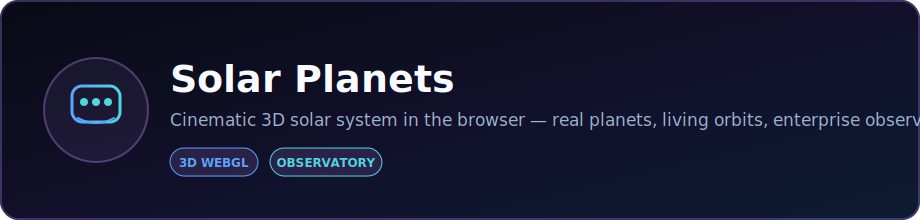

<p align="center">
  
</p>

<p align="center">
  <strong>Cinematic 3D solar system in the browser — real planets, living orbits, enterprise observatory UI.</strong>
</p>

<p align="center">
  <a href="https://dacameragirl.github.io/solar-planets/"></a>
  <a href="https://github.com/DaCameraGirl/solar-planets"></a>
</p>

<p align="center">
  
  
</p>

### Languages

<p align="center">
  
  
  
</p>

### Stack

<p align="center">
  
  
</p>

<p align="center">
  Built by <strong>Angela Hudson</strong> · <a href="https://github.com/DaCameraGirl">DaCameraGirl</a>
</p>
# Solar Planets

<p align="center">
  <a href="README.md"></a>
  <a href="README.es.md"></a>
  <a href="README.fr.md"></a>
  <a href="README.de.md"></a>
  <a href="README.pt-BR.md"></a>
  <a href="README.zh-CN.md"></a>
  <a href="README.ja.md"></a>
  <a href="README.ko.md"></a>
  <a href="README.it.md"></a>
  <a href="README.ar.md"></a>
</p>

<p align="center">
  <a href="https://dacameragirl.github.io/solar-planets/"></a>
  <a href="https://dacameragirl.github.io/links/"></a>
  <a href="https://dacameragirl.github.io/latent-observatory/"></a>
  
  
</p>

<p align="center">
  
</p>

**Our solar system — as a place you can orbit.**

A standalone cinematic 3D solar system in the browser. Real planets, living orbits, Saturn's rings, Earth's moon, and an enterprise observatory UI. Bundled 2K same-origin textures (Solar System Scope), Unreal Bloom post-processing, and premiere glass chrome — no embeddings, no ML, no server. Spin-off from the [Latent Space Observatory](https://github.com/DaCameraGirl/latent-observatory) solar-system layer.

<p align="center">
  
</p>

<p align="center">
  
</p>

<p align="center"></p>
<p align="center"></p>


| What | URL |
|---|---|
| **Live app** | [dacameragirl.github.io/solar-planets](https://dacameragirl.github.io/solar-planets/) |
| **GitHub repo** | [github.com/DaCameraGirl/solar-planets](https://github.com/DaCameraGirl/solar-planets) |
| **Project hub** | [dacameragirl.github.io/links](https://dacameragirl.github.io/links/) (AI tools) |
| **Latent Observatory** | [dacameragirl.github.io/latent-observatory](https://dacameragirl.github.io/latent-observatory/) (parent project) |

<p align="center">
  
</p>

<p align="center"></p>
<p align="center"></p>


| | Latent Space Observatory | **Solar Planets** (this repo) |
|---|---|---|
| Purpose | Visualize AI embedding spaces | Explore our solar system |
| Main visual | Data points + semantic clusters | **Planets are the whole point** |
| Audience | ML researchers | Everyone |

<p align="center"></p>
<p align="center"></p>


| Feature | What it does |
|---|---|
| **Sun** | Pulsing corona and dynamic lighting |
| **8 planets** | Bundled 2K surface maps (same-origin), atmosphere halos, scaled orbits |
| **Rings & Moon** | Saturn's rings and Earth's moon |
| **Starfield** | 3,200 stars |
| **Exploration** | Click any planet for facts; legend chips for quick focus |
| **Camera** | Auto-orbit, time scale, orbit path toggle |
| **Bloom** | Unreal Bloom post-processing for cinematic glow |
| **Premiere UI** | Enterprise observatory glass chrome |
| **100% client-side** | Static HTML/CSS/JS, Three.js from CDN, no build step |

Mouse: drag to look around · scroll to zoom.

<p align="center">
  
</p>

<p align="center"></p>
<p align="center"></p>


No build step required.

```bash
git clone https://github.com/DaCameraGirl/solar-planets.git
cd solar-planets
npx serve .
```

Open `http://localhost:3000`

<p align="center"></p>
<p align="center"></p>


© 2026 Angela Hudson (DaCameraGirl). All rights reserved. See [LICENSE](LICENSE).