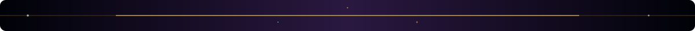

<p align="center">
  
</p>

# Planetas do Sistema Solar

<p align="center">
  <a href="README.md"></a>
  <a href="README.es.md"></a>
  <a href="README.fr.md"></a>
  <a href="README.de.md"></a>
  <a href="README.pt-BR.md"></a>
  <a href="README.zh-CN.md"></a>
  <a href="README.ja.md"></a>
  <a href="README.ko.md"></a>
  <a href="README.it.md"></a>
  <a href="README.ar.md"></a>
</p>

<p align="center">
  <a href="https://dacameragirl.github.io/solar-planets/"></a>
  <a href="https://dacameragirl.github.io/links/"></a>
  <a href="https://dacameragirl.github.io/latent-observatory/"></a>
  
  
</p>

<p align="center">
  
</p>

**Nosso sistema solar — um lugar que você pode orbitar.**

Um sistema solar cinematográfico em 3D no navegador, independente e focado. Planetas reais, órbitas vivas, anéis de Saturno, Lua da Terra e interface de observatório enterprise. Texturas 2K empacotadas same-origin (Solar System Scope), pós-processamento Unreal Bloom e UI premiere — sem embeddings, sem ML, sem servidor. Spin-off da camada do sistema solar do [Observatório do Espaço Latente](https://github.com/DaCameraGirl/latent-observatory).

<p align="center">
  
</p>

<p align="center">
  
</p>

## Repositório vs. app ao vivo

| O quê | URL |
|---|---|
| **App ao vivo** | [dacameragirl.github.io/solar-planets](https://dacameragirl.github.io/solar-planets/) |
| **Repositório GitHub** | [github.com/DaCameraGirl/solar-planets](https://github.com/DaCameraGirl/solar-planets) |
| **Hub do projeto** | [dacameragirl.github.io/links](https://dacameragirl.github.io/links/) (ferramentas de IA) |
| **Observatório latente** | [dacameragirl.github.io/latent-observatory](https://dacameragirl.github.io/latent-observatory/) (projeto pai) |

<p align="center">
  
</p>

## Destaques

| Função | O que faz |
|---|---|
| **Sol** | Coroa pulsante e iluminação dinâmica |
| **8 planetas** | Mapas de superfície 2K empacotados (same-origin), halos atmosféricos, órbitas escaladas |
| **Anéis e Lua** | Anéis de Saturno e Lua da Terra |
| **Campo estelar** | 3.200 estrelas |
| **Exploração** | Clique em qualquer planeta para fatos; chips de legenda para foco rápido |
| **Câmera** | Órbita automática, escala de tempo, caminhos orbitais |
| **Bloom** | Pós-processamento Unreal Bloom para brilho cinematográfico |
| **UI premiere** | Interface enterprise tipo observatório com glassmorphism |
| **100% no cliente** | HTML/CSS/JS estático, Three.js via CDN, sem etapa de build |

Mouse: arrastar para olhar ao redor · rolar para zoom.

<p align="center">
  
</p>

## Desenvolvimento local

Nenhuma compilação necessária.

```bash
git clone https://github.com/DaCameraGirl/solar-planets.git
cd solar-planets
npx serve .
```

Abra `http://localhost:3000`

## Licença

© 2026 Angela Hudson (DaCameraGirl). Todos os direitos reservados. Consulte [LICENSE](LICENSE).