<p align="center">
  
</p>

# 太阳系行星

<p align="center">
  <a href="README.md"></a>
  <a href="README.es.md"></a>
  <a href="README.fr.md"></a>
  <a href="README.de.md"></a>
  <a href="README.pt-BR.md"></a>
  <a href="README.zh-CN.md"></a>
  <a href="README.ja.md"></a>
  <a href="README.ko.md"></a>
  <a href="README.it.md"></a>
  <a href="README.ar.md"></a>
</p>

<p align="center">
  <a href="https://dacameragirl.github.io/solar-planets/"></a>
  <a href="https://dacameragirl.github.io/links/"></a>
  <a href="https://dacameragirl.github.io/latent-observatory/"></a>
  
  
</p>

<p align="center">
  
</p>

**我们的太阳系 — 一个你可以环绕飞行的地方。**

浏览器中的独立电影级 3D 太阳系：真实行星、生动轨道、土星环、地球月球和企业级观测站界面。捆绑的 2K 同源纹理（Solar System Scope）、Unreal Bloom 后处理与 premiere UI — 无嵌入、无 ML、无服务器。从[潜在空间观测站](https://github.com/DaCameraGirl/latent-observatory)太阳系层独立拆分而来。

<p align="center">
  
</p>

<p align="center">
  
</p>

## 仓库与在线应用

| 内容 | URL |
|---|---|
| **在线应用** | [dacameragirl.github.io/solar-planets](https://dacameragirl.github.io/solar-planets/) |
| **GitHub 仓库** | [github.com/DaCameraGirl/solar-planets](https://github.com/DaCameraGirl/solar-planets) |
| **项目中心** | [dacameragirl.github.io/links](https://dacameragirl.github.io/links/)（AI 工具） |
| **潜在空间观测站** | [dacameragirl.github.io/latent-observatory](https://dacameragirl.github.io/latent-observatory/)（父项目） |

<p align="center">
  
</p>

## 功能亮点

| 功能 | 说明 |
|---|---|
| **太阳** | 脉动日冕与动态光照 |
| **8 颗行星** | 捆绑 2K 表面贴图（同源）、大气光晕、按比例轨道 |
| **环与月球** | 土星环与地球月球 |
| **星空** | 3,200 颗恒星 |
| **探索** | 点击任意行星查看数据；图例芯片快速聚焦 |
| **相机** | 自动环绕、时间缩放、轨道路径 |
| **泛光** | Unreal Bloom 后处理，电影级光辉 |
| **Premiere UI** | 企业级观测站玻璃态界面 |
| **100% 客户端** | 静态 HTML/CSS/JS，CDN 加载 Three.js，无需构建 |

鼠标：拖动环顾 · 滚轮缩放。

<p align="center">
  
</p>

## 本地开发

无需构建。

```bash
git clone https://github.com/DaCameraGirl/solar-planets.git
cd solar-planets
npx serve .
```

打开 `http://localhost:3000`

## 许可证

© 2026 Angela Hudson (DaCameraGirl)。保留所有权利。请参阅 [LICENSE](LICENSE)。